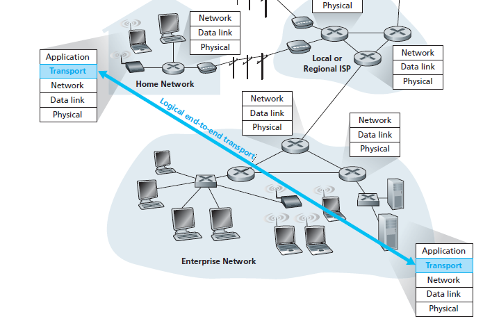

## 1. Background

- Q1: What does transport-layer protocol do?
    - A **transport-layer protocol** **provides** for **logical communication** between **application processes** running on different hosts.
- Q2: What is logical communication?
    - **Logical communication** means from an application’s perspective it is as if the hosts running the processes were directly connected but in reality, the hosts may be on opposite sides of the planet

      

- Q3: Where is transport-layer protocol implemented?
    - At end systems
- Q4: What is mean of communication between application layer ↔ transport layer?
    - Via a **interface** named [**SOCKET**](https://www.notion.so/Process-283b90defeae80a1b4dfed8f4bd78003?pvs=21)
- Q5: How many protocols are there in transport layer?
    - TCP and UDP
- Q6: A quick description when sending data between processes?
    - On sending side:
        - Transport layer **convert** application-layer message into smaller chunk and add **header** to create a **segment**
        - Transport layer then **passes** the segment to **network layer** (I’ll stop right here and continue to introduce in network layer chapter)
    - On the receiving side:
        - The network layer **extracts** the transport-layer **segment** then **segment up** to transport layer
- Q7: Relationship between transport layer and network layer?
    - A **transport-layer protocol** **provides** for **logical communication** between **application processes** running on different hosts.
    - A **network-layer protocol** **provides** for **logical communication** between **hosts**.
- Q8: What is the most fundamental responsibility of transport layer protocol?
    - **Extend** IP’s delivery service between **two end systems** → a delivery service between **two processes** running on the end systems
    - **Extending** host-to-host delivery → process-to-process delivery is called transport-layer multiplexing and demultiplexing.

## 2. Multiplexing and Demultiplexing

- Q1: Short description about **socket**?
    - Each process can have one more multiple **sockets**
    - **Sockets** is a intermediary between processes and transport layer
    - Each **socket** has **a unique identifier**
- Q2: How the multiplexing works?
    - The job of gathering data chunks at the source host from **different sockets**
    - Encapsulating each data chunk with header information (that will later be used in demultiplexing) to create segments
    - Then passing the segments to the network layer
- Q3: How the demultiplexing works?
    - The job of examining some set of fields in a segment to identify the **receiving socket**
    - Delivering data to **correct socket**

- Motivation
    - **In multiplexing/demultiplexing, What factors do we need to identify correct sockets?**
- Solution
    - We know that transport-layer multiplexing requires
        - Sockets have unique identifiers
        - Each segment has special fields that indicate the socket to which the segment is to be delivered
    - These special fields are the **source port number** field and the **destination port number** field

      

    - Each port number is a 16-bit number, ranging from **0 to 65535**
    - The port numbers ranging from **0 to 1023** are called well-known port numbers and are restricted

### **2.1 Connectionless**

- **UDP socket** is **fully identified by a two-tuple consisting** of a destination IP address and a destination port number
- If two UDP segments have
    - Different source IP addresses
    - and/or source port numbers,
    - but have the same destination IP address and destination port number
    - then the two segments will be directed to the **same destination process via** **the same destination socket.**

### 2.2 Connection-Oriented

- **TCP socket** is identified by a **four-tuple**: (source IP address, source port number, destination IP address, destination port number).
- If two TCP segments have
    - Different source IP addresses
    - and/or source port numbers,
    - but have the same destination IP address and destination port number
    - then the two segments will be directed to the **two different process via** **the same destination socket.**

      

## 3. Connectionless Transport: UDP

- Q1: Why is UDP considered connectionless?
    - UDP is said to be **connectionless** because there is **no handshaking** between sending and receiving transport-layer entities before sending a segment
- Q2: List some applications use UDP?

  

- Q3: Why an application developer would ever choose to build an application over UDP rather than over TCP?
    - Finer application-level control over what data is sent and when
    - No connection establishment
    - No connection state
    - Small packet header overhead (UDP only has 8-bytes header)
- Q4: How to make reliable data over UDP?
    - This can be done if reliability is built into the application itself (for example, by **adding acknowledgment** and **retransmission mechanisms**)
- Q5: UDP Segment Structure

  

## 4. Principles of Reliable Data Transfer (*)

- Q1: What does RDT do?
    - It is the responsibility of a reliable data transfer protocol to implement **service abstraction**
    - The **service abstraction** provided to the upper-layer entities is that of a reliable channel through which data can be transferred

      

    - Even though lower-layer of RDT can be unreliable channel, RDT is also responsible for making sure data transferred is safe.
- Q2: What is implementation of RDT?
    - **ARQ** (Automatic Repeat reQuest) protocols
    - **Three additional** protocol **capabilities** are required in **ARQ**
      protocols to handle the presence of bit errors:
        - **Error detection:** allow the receiver to **detect** when **bit errors have occurred**.
        - **Receiver feedback:** the receiver to provide explicit feedback to the sender. The positive (ACK) and negative (NAK) acknowledgment
        - **Retransmission:** A packet that is received in error at the receiver will be retransmitted by the sender
- From now on, we’ll use **The finite-state machine (FSM)** to describe RDT protocols:
    - Three main factors are used in FSM: **states**, **events** and **actions**
    - Switch from state 1 to state 2 is called a **transition**
    - Notation
        - Circle: **states**
        - Arrow: **transitions**
        - Above horizontal line: **events**
        - Below horizontal line: **actions** when **events** occur

### rdt 1.0 - Reliable Data Transfer over a Perfectly Reliable Channel

### rdt 2.0 - Reliable Data Transfer over a Channel with Bit Errors

- It is important to note that when the sender is in the wait-for-ACK-or-NAK state, it **cannot get** more **data from** the **upper layer**
- Because of this behavior, protocols such as rdt2.0 are known as **stop-and-wait** protocols.

### rdt 2.1

- Motivation
    - **In protocol rdt2.0,** we haven’t accounted for the possibility that the **ACK or NAK packet** **could be corrupted**!
- Solution
    - The sender simply to **resend the current data packet** when it receives a **garbled** ACK or NAK packet. (This would introduce **duplicate packets**)
    - to add a **new field** to the data packet and have **the sender number** its data packets by putting a sequence number
    - For this simple case of a **stop-and-wait** protocol, a **1-bit** sequence number will suffice

### rdt 2.2 NAK-free protocol

- Motivation
    - A **NAK** only means “the next packet was not received correctly.”
- Solution
    - But the same effect can be achieved if the receiver just **sends a duplicate ACK for the last correctly received packet.**

      → This allows us to **eliminate NAK** entirely and use only ACK messages.

### rdt 3.0 - Reliable Data Transfer over a Lossy Channel with Bit Errors

- Motivation
    - **Two** additional **concerns** must now be addressed by the protocol:
        - **How to detect packet loss**
        - **What to do when packet loss occurs** (solved by **rdt 2.0**)
- Solution
    - If the sender is willing to wait long enough so that it is certain that a packet has been lost, it can simply retransmit the data packet
    - Implementing **a time-based retransmission** mechanism requires a **countdown timer** that **can interrupt the sender** after a given amount of time has expired
    - rdt3.0 is sometimes known as the alternating-bit protocol.

- Q1: How long must the sender wait to be certain that something has been lost?
    - **At least** as long as a **round-trip delay** between the sender and receiver
- Q2: In rdt3.0, it introduces the possibility of duplicate data packets?
    - Happily, protocol rdt2.2 already has enough functionality (that is, sequence numbers) to handle the case of duplicate packets.

## 5. Pipelined Reliable Data Transfer Protocols

- Motivation
    - At the heart of rdt3.0’s performance problem is the fact that it is **a stop-and-wait** protocol
    - To appreciate the performance impact of this stop-and-wait behavior, (check 3.4.2 Computer networking, A top-down approach 6th edition)
    - Key takeaways,
        - with a packet of 8000 bits length and the transmission rate of 1 Gbps
        - The sender was busy only 2.7 hundredths of one percent of the time! (0.00027)
    - **The problem with stop-and-wait is low efficiency due to idle time.**
- Solution
    - Rather than operate in a stop-and-wait manner, the sender is allowed to **send multiple packets without waiting** for acknowledgments.
    - The solution is **pipelining**

      

    - **Pipelining** requires:
        - A larger range of sequence numbers
        - Buffering at both sender and receiver
        - Different error recovery strategies: **Go-Back-N** or **Selective Repeat**

### **5.1 Go-Back-N (GBN) (*)**

- Before we dive deep into this protocol. You can try and play around its demo at: [https://computerscience.unicam.it/marcantoni/reti/applet/GoBackProtocol/goback.html](https://computerscience.unicam.it/marcantoni/reti/applet/GoBackProtocol/goback.html)
- GBN protocol is itself as a **sliding-window protocol**
- Data structure
    - A N is the window size
    - A base is the sequence number of the oldest un-ack packet
    - A nextseqnum is the smallest unused sequence number
    - So, we now have 4 intervals in the range of sequence number
        - `[0, base - 1]` : packets that have already been transmitted and acknowledged
        - `[base, nextseqnum - 1]` : packets that have already been sent out and but not yet acknowledged
        - `[nextseqnum, base + N - 1]` : packets can be sent immediately
        - `[base + N, $\infty$]` : packets cannot be used until

          

- State machine

  

  

- Event
    - The **GBN sender** reacts to three events:
        - **Invocation from above:** If the window is not full, a new packet is created and sent. If full, the sender rejects the data (or buffers it in real systems).
        - **Receipt of an ACK:** GBN uses **cumulative ACKs**, meaning that an ACK for packet *n* confirms all packets up to *n*.
        - **Timeout event:** If a timeout occurs, the sender **retransmits all unacknowledged packets**. GBN maintains only a **single timer** for the oldest outstanding packet. The timer is restarted when an ACK is received (if unacknowledged packets remain), or stopped if none remain.
    - The **GBN receiver** is much simpler:
        - If the expected packet `n` arrives correctly, it delivers it to the upper layer and sends **ACK(n)**.
        - If an out-of-order packet arrives (e.g., `n+1` when expecting `n`), it is discarded and the receiver resends the last ACK  (e.g., **ACK(**`n`**)**)
        - Do not buffer out-of-order packets, making the receiver design simple. It only keeps track of **expectedseqnum**.
            - Example: With a window size of 4, if packet 2 is lost, packets 3, 4, and 5 are discarded until packet 2 is correctly retransmitted by the sender.

### **5.2 Selective Repeat (SR)**

- Before we dive deep into this protocol. You can try and play around its demo at: [https://computerscience.unicam.it/marcantoni/reti/applet/SelectiveRepeatProtocol/selRepProt.html](https://computerscience.unicam.it/marcantoni/reti/applet/SelectiveRepeatProtocol/selRepProt.html)
- Motivation
    - In GBN, When the **window size** and **bandwidth-delay product** are **both large**
    - A single packet error can thus cause GBN to **retransmit a large number of packets**
- Solution
    - **Selective-repeat protocols** **avoid** unnecessary retransmissions by having the sender retransmit only those packets that it suspects were received in error (that is, were lost or corrupted) at the receiver.
- Data structure
    - Almost same as GBN
- Event

  

  

- Compared to GBN
    - **Go-Back-N (GBN):**
        - The receiver discards out-of-order packets.
        - When a timeout occurs, the sender resends **all unacknowledged packets**.
        - The receiver does not need a buffer (only maintains one variable: `expectedseqnum`).
    - **Selective Repeat (SR):**
        - The receiver buffers out-of-order packets and sends an ACK for **every correctly received packet**.
        - When a timeout occurs, the sender resends **only the specific unacknowledged packet**, not the entire window.
        - The receiver requires a buffer to hold out-of-order packets until they can be delivered in order.
- Drawback
    - The lack of synchronization between sender and receiver windows

      

    - Solution, use **window-size ≤ N/2**

## 6. Connection-Oriented Transport: TCP

- Q1: Why is TCP considered connection-oriented?
    - Two processes **must** first **“handshake”** with each other before one application process can begin to send data to another,  **“handshake”** often referred to as a **three-way handshake**.
    - A TCP connection is also **always point-to-point**
- Q2: Which communication protocols does TCP provide?
    - A TCP connection provides a **full-duplex service**
- Q3: What is buffer?
    - Created during the initial three-way handshake
    - Each TCP connection has its own **send buffer** and **receive buffer**
- Q4: What is Maximum Segment Size (MSS)?
    - It is the maximum size of application-layer data (payload) that TCP can place into a TCP segment.
    - Not including **TCP header + IP header**.
- Q5: TCP Segment Structure

  

- Q6: What are important fields in TCP Segment Structure?
    - **Two** of the most important **fields** in the TCP segment header are **the sequence number**
      field and **the acknowledgment number** field
- Q7: What is TCP’s perspective about data?
    - TCP views data as an **unstructured but ordered stream of bytes**

### **6. 1  The sequence number** field

- **Sequence numbers** in TCP are assigned over the **byte stream**, not over the segments themselves.
- **The sequence number** for a segment is therefore the byte-stream number of the **first byte** in the segment
- Example:
    - Suppose there is a **file of 500,000 bytes** to send.
    - **MSS = 1,000 bytes** (so each segment can carry up to 1,000 bytes of application data).
    - TCP splits the file into **500 segments**, each with 1,000 bytes.
    - The sequence number of a segment is the **byte-stream number of its first byte**:
        - Segment 1: starts at byte **0** → Sequence Number = 0
        - Segment 2: starts at byte **1000** → Sequence Number = 1000
        - Segment 3: starts at byte **2000** → Sequence Number = 2000
        - … up to Segment 500: starts at byte **499,000** → Sequence Number = 499,000

### **6. 2  The acknowledgment**  field

- **Acknowledgment (ACK) number** = the sequence number of the **next byte expected**.
- Since TCP is **full-duplex**, each side (Host A and Host B) maintains its own sequence numbers and acknowledgment numbers independently.
- When Host A sends a segment to Host B, it includes an **ACK number** telling B:

  👉 “I have received everything up to byte X–1, and now I expect byte X.”

- Example:
    - Host A received  a **byte-stream from 0 to 535** by host B.
    - Expected next byte A waiting for is **536**.
    - Then A send a segment to B, in header will have:
        - **ACK = 536**
- Q8: Three-way handshake?

  

- Q9: Telnet example

  

### 6.3 TCP RDT A Few Interesting Scenarios

## 7. Congestion control algorithm

- TCP uses **end-to-end congestion control** because IP does not provide feedback about congestion.
- **Idea**: The sender adjusts its sending rate based on perceived congestion.
    - If the network seems uncongested → increase send rate.
        - If congestion is detected → decrease send rate.

- **Congestion events:**
    - **Timeout (loss detected)**
    - **3 duplicate ACKs**

### 7. 1 Slow start

- **Initialization**
    - `cwnd` starts at **1 MSS** (≈ MSS/RTT send rate).
    - Example: MSS = 500B, RTT = 200ms → initial rate ≈ 20 kbps.
- **Growth Phase**
    - Each ACK → `cwnd += 1 MSS`.
    - Sending rate doubles **every RTT** (exponential growth).
    - Example: after 1 ACK → `cwnd=2`, then 4, 8, 16…
- **Ending Slow Start**
    - **Timeout (loss detected)**:
        - Set `cwnd = 1 MSS` (restart slow start).
        - Set `ssthresh = cwnd/2` (congestion threshold).
    - **cwnd ≥ ssthresh**:
        - Exit slow start.
        - Enter **Congestion Avoidance** (linear growth).
    - **3 duplicate ACKs**:
        - Perform **Fast Retransmit**.
        - Enter **Fast Recovery**.

### 7.2 Congestion Avoidance

- **Initialization**
    - Entered when `cwnd ≥ ssthresh` after Slow Start.
    - `cwnd` starts at current value (≈ ssthresh).
- **Growth Phase**
    - Each ACK → `cwnd += MSS * (MSS / cwnd)` (≈ linear growth of 1 MSS per RTT).
    - Sending rate increases cautiously to avoid congestion.
- **Ending Congestion Avoidance**
    - **Timeout (loss detected)**:
        - Set `cwnd = 1 MSS` (restart Slow Start).
        - Set `ssthresh = cwnd / 2`.
    - **3 duplicate ACKs**:
        - Perform **Fast Retransmit**.
        - Halve `cwnd` (add 3 MSS for the triple-ACKs).
        - Enter **Fast Recovery**.

### 7.3 **Fast Recovery (RENO)**

- **Initialization**
    - Entered after **3 duplicate ACKs** during Congestion Avoidance.
    - `cwnd` = ssthresh + 3 MSS.
- **Recovery Phase**
    - Retransmit lost segment immediately (**Fast Retransmit**).
    - For each additional duplicate ACK → `cwnd += 1 MSS` (keeps sending new segments).
- **Ending Fast Recovery**
    - Upon receiving ACK for **all outstanding segments**:
        - `cwnd = ssthresh` (resume Congestion Avoidance).